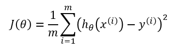
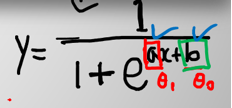

# Regression Cost Function

1. MSE (Mean Squred Error) Function
평균제곱오차

2. MAE (Mean Absolute Error) Function
평균절대값오차

3. MAPE (Mean Absolute Percentage Error) Function
평균절대값퍼센트오차

4. RMSE (Root Mean Squred Error) Function
평균제곱에 루트 씌운 오차

> CostFunction < 목적함수

- a = (weight)가중치
- b = (bias)편향치
- y = θ
- y = ax + b

## Gradient Descent(경사하강법)
x = θ  y = MSE값을 미분을 하여 접선의 기울기를 구하여 최적화된 MSE값을 도출하는 알고리즘

1. y = θ_1x + θ_0 : 원인 ex) 2x + 3 (θ1의 값은 랜덤)
2. 모델 모양 위치
3. 결과 = MSE

2번을 없앤다면 원인이 결과를 낳는다.

## MSE의 최적화된 위치
Global Minimum : 전역 최소값

## Leaning Rate = α = 보폭
Hyper Parameter (초매개변수)

## Loss Surface
θ_0
## Optimaization 최적화
MSE' = 0(미분방정식)을 통해 구할 수 있음
## Local Mimima 국소최소값 :: 주의
**경사하강법 도중 미세한 경사들이 MSE의 적절한 값으로 대체될 수 있음**

# ClassiFication
1. Logistic Regression (로지스틱 회귀)

x데이터가 양성(Positive)일 확률

## Logistic Regression
두 가지의 경우가 나온다.
1. y값
2. 카테고리 값 ex) 0 or 1
## Cutoff
Hyper-parameter default : 0.5
- 0.5초과의 값으로 설정 시, 모델이 엄격해짐
- 0.5미만의 값으로 설정 시, 모델이 느슨해짐

## Sigmoid Function

> 1 / 1 : 상수 + e(자연상수)

## CrossEntropy
에러율이 낮을 수록 분류를 더 잘한 것이다.

## Logits

# Confusion Matrix (혼동행렬)
classification모델 후 평가지표

|Confusion Matrix|Positive|Negative|
|-|-|-|
|Positive|True Positive|False Positive|
|Negative|True Negative|False Negative|

## 예시
암환자 100명의 데이터를 예측했다면,
|Confusion Matrix|암안걸림|암걸림|
|-|-|-|
|암안걸림|True Positive(30)|False Positive(15)|
|암걸림|False Negative(5)|True Negative(50)|

판단지표 : 암에 걸림에도 불구하고 안 걸렸다고 분류한 경우 위험 = Recall(재현율) 사용해아함

### Recall(재현율)
TP + FN / TP = 30 + 5 / 30

스팸메일을 분류한다면,
|Confusion Matrix|스팸메일아님|스팸메일임|
|-|-|-|
|스팸메일아님|True Positive(30)|False Positive(15)|
|스팸메일임|False Negative(5)|True Negative(50)|

판단지표 : 스팸메일이 아닌데도 불구하고 스팸메일로 분류한 경우 위험 = Precision(정밀도)

### Precision(정밀도)
TP + FP / TP

