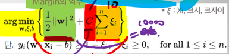

# Classification
# Logistic Regression

## Threshold : 한계점
Sigmoid 함수를 이용하면 한계점을 정해줘야함
- 높을 수록 엄격해짐
- 낮을 수록 느슨해짐

# 평가지표
## ROC Curve (Receiver Operating Characteristic Curve)
직각일 때 성능이 좋다고 판단함

## AUROC (Area Under the ROC Curve)
ROC Curve 밑의 면적을 기준으로 좋은지 나쁜지를 판단함

# 머신러닝 (Machine Learning)
# 분류모델
지도학습모델 분류뿐 아니라 회귀에도 활용가능
# SVM (Support Vector Machine)
Margin을 최대화하는 결정 경계(면)을 찾는 기법

# Soft Margin SVM
## 목적함수
1. MIN
2. MAX

# Margin
1. Max = 2 / ||w||(놈)
2. MIN = Max의 역수

C : Hyper-parameter 작게 주면 무시함

크사이 : 분류된 데이터의 오류 거리

# 선형적으로 분리되지 않는 경우
선형분리불가능문제 (Linearly Unseparable)

고차원 공간으로 변환시킴
# Kernel Function
Hyper-parameter
1. 다항커널
2. 가우시안

# 딥러닝
1. LinearCombination

## 근간
Layer = Learnable Kernel

## 특성교차 (Feature Crosses)

