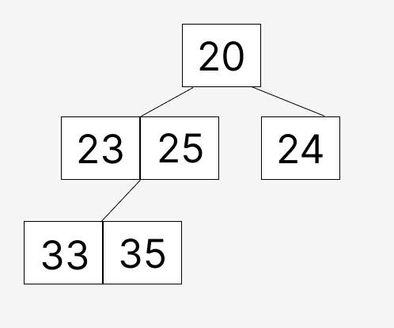
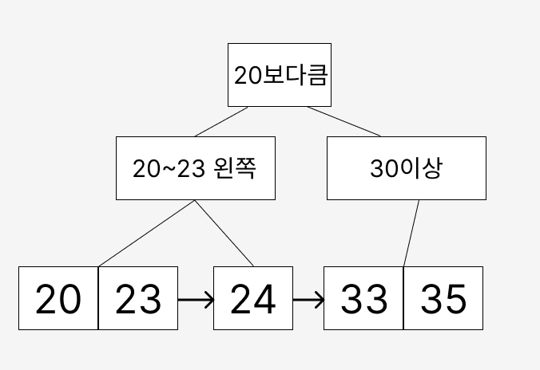

# index
특정 데이터를 찾을려고 할때, 데이터양이 많다면 **FULL SCAN**을 하기 때문에 속도가 굉장히 느리다.

- FULL SCAN : 데이터를 위에서부터 마지막까지 순차적으로 찾는 것

# 예시

|이름|나이|
|-|-|
|홍길동|20|
|광개토대왕|25|
|이순신|35|
|손오공|23|

나이가 23인 데이터를 찾기위해 위에서 부터 순차적으로 데이터를 찾는다. - **FULL SCAN**

`SELECT * FROM tableName WHERE 나이 = 23;`

# index

- 순서대로 정렬을 해줌
- 찾고자하는 인덱스가 걸린 것의 반씩 쪼개면서 찾음

|이름|나이|인덱스(나이)|
|-|-|-|
|홍길동|20|20|
|광개토대왕|25|23|
|이순신|35|24|
|손오공|23|25|
|김개똥|24|33|
|김모씨|33|35|

# 예시

`SELECT * FROM tableName WHERE 나이 = 35;`

> 20 -> 23 -> 25 -> 35

# B-tree

`SELECT * FROM tableName WHERE 나이 = 35;`

> 20 -> 25 -> 35

# B+tree

`SELECT * FROM tableName WHERE 나이 = 35;`

> 20보다큼 -> 30이상 -> 35

