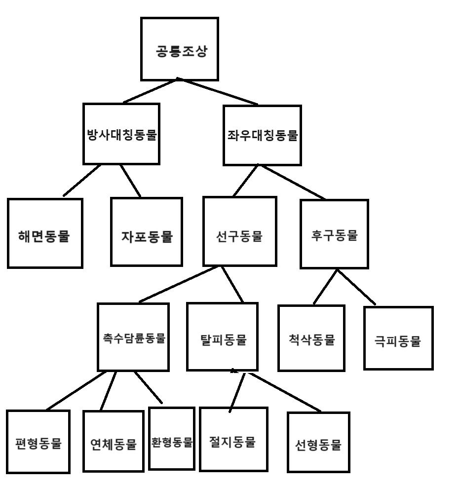

# Class 예시



# 제네릭(Generic) - 일반적인
데이터 형식에 의존하지 않고 하나의 값이 여러 다른 데이터 타입들을 가질 수 있도록하는 방법

**클래스 내부에서 데이터의 타입을 지정하는 것이 아닌 외부에서 데이터 타입을 지정해주는 것**

- T : Type 
- E : Element
- K : Key
- V : Value

# 주의점
primitive type은 올 수 없다. Reference Type만 가능하다.
- primitive type : int, double, char ... 등 (어디서는 리터럴(Literal)이라고도 한다.)
- reference type : Integer, Double, Character ... 등 (Wapper type이라고도 한다.) 추가적으로 자신이 만든 Class도 타입으로 올 수 있다.


# 사용방식
```java
public class ClassName<T> {}
public interface InterfaceName<T>{}
public class ClassName<T, K>{}
public interface InterfaceName<T, K>{}
```

# 제네릭 메소드
**정적 메소드로 선언할 필요하기 때문에 사용**

`static` 변수, `static` 함수 등은 프로그램 실행시, 메모리에 올라가있다.

제네릭을 사용하는 함수라면, `static` 함수 사용시, 객체가 생성되기 전에 메모리에 올라간다. 그럼 타입은?

# 사용방식
```java
public <T> T genericMethod(T object){}
```

# 제한된 `Generic`과 와일드 카드
<>안의 데이터를 특정 범위 내로 좁혀서 제한하고 싶다. - `extends`, `super`, `?(물음표)` : 와일드카드 / 알 수 없는 타입

- `? extends T` : 상한경계
- `? super T` : 하한 경계

# 선언방식
```java
<K extends T> 
<K super T>
<? extends T>
<? super T> 
<?>
```

# 상한경계
최상위 타입으로 한계가 정해짐 - `extends T` T 타입을 포함한 자식타입만 가능

예시) `T extends 선구동물` 선구동물 및 하위 클래스들만 타입으로 지정이 가능하다.

# 하한경계
최하위 타입으로 한계가 정해짐 - `super T` T타입을 포함한 상위타입만 가능

예시) `T super 선구동물` 선구동물 및 상위 클래스들만 타입으로 지정이 가능하다.


