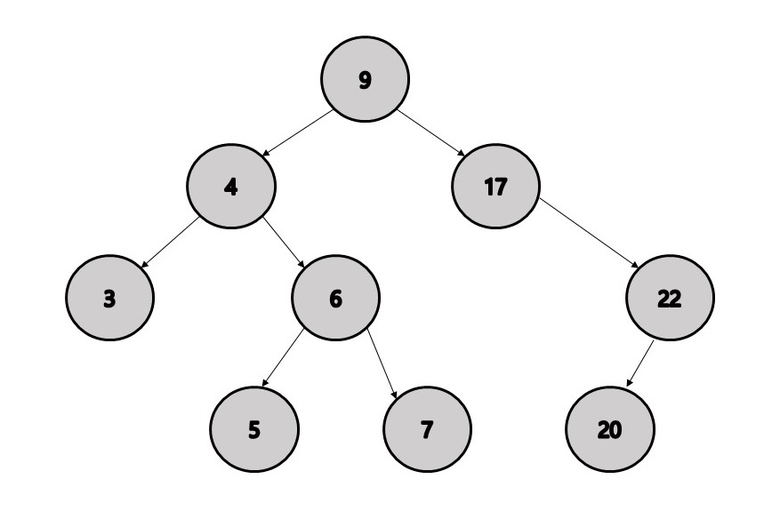

# XML 파일 형식
트리모양으로 되어있음


# 노드의 종류
1. 문서노드
2. 요소노드
3. 속성노드
4. 텍스트노드
5. 주석노드

```XML
<?xml version="1.0" encoding="UTF-8"?>
<!-- 루트노드 -->
<programming_languages>
    <!-- 요소노드 -->
    <language>
        <!-- 형제노드 = 요소노드 + 속성노드 / 텍스트노드들  -->
        <!-- 요소노드 : name, 텍스트노드 : CSS -->
        <name>CSS</name>
        <!-- 요소노드 : category, 텍스트노드 : web -->
        <category>web</category>
        <!-- 요소노드 : developer, 텍스트노드 : W3C -->
        <developer>W3C</developer>
        <!-- 요소노드 : version, 속성노드 : status, 텍스트노드 : 3.0-->
        <version status="stable">3.0</version>
        <!-- 요소노드 : priority, 속성노드 : rating, 텍스트노드 : high -->
        <priority rating="3">high</priority>
    </language>
</programming_languages>
```